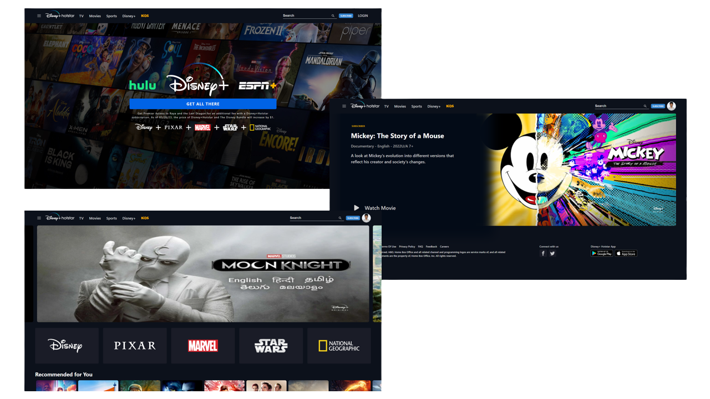

<p align="center">
  <a href="#about-project">About project</a> •
  <a href="#how-to-use">How To Use</a> •
  <a href="#live-link">Live link</a>
</p>

# Disney+ Hotstar Clone

A beautiful Clone of Disney+ Hoststar website build with <a href="https://reactjs.org/" target="_blank">React js</a> and integrated with <a href="https://firebase.google.com/" target="_blank">Firebase</a>


### Tech Stack

`HTML` `CSS` `JavaScript` `React` `Chakra UI` `Firebase`


### App Screenshots

**`DESKTOP VIEW`**



**`MOBILE VIEWES`**
<br />


## About project

* Responsive Design
  - Desktop, mobile and tablet.

* Fully Dynamic - Make changes, See changes
  - Instantly see what movies you click.

<br/>


## How To Use

To clone and run this application, you'll need [Git](https://git-scm.com) and [Node.js](https://nodejs.org/en/download/) (which comes with [npm](http://npmjs.com)) installed on your computer. From your command line:

```bash
# Clone this repository
$ git clone https://github.com/Arbaz86/DisneyPlus_Hotstar_Clone.git

# Go into the repository
$ cd DisneyPlus_Hotstar_Clone

# Install dependencies
$ npm install

# Run the app
$ npm run dev
```

> **Note**
> If you're using Linux Bash for Windows, [see this guide](https://www.howtogeek.com/261575/how-to-run-graphical-linux-desktop-applications-from-windows-10s-bash-shell/) or use `node` from the command prompt.


## Live Link

[Disney+ Hotstar Clone](https://disneyplus-clone-ac099.web.app/) - Live link of the project


